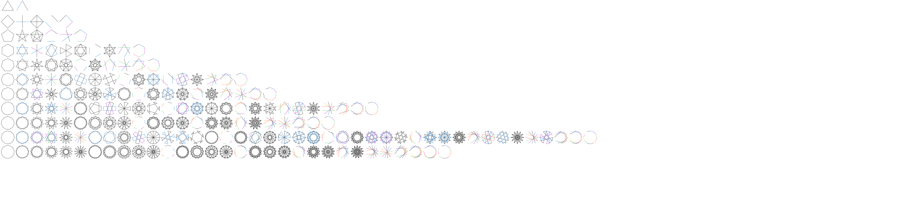

# n-pointed-stars

This is JavaScript program that draws pentagram-like stars, but with
_n_ points instead of 5, and with various step sizes as you walk around
the perimeter of a regular polygon with _n_ sides.

This same code is also available as an [Observable](
https://observablehq.com/@perlmonger42/drawing-n-pointed-stars)
and as a [JSFiddle](https://jsfiddle.net/perlmonger42/e84bqkhx/106/).

## Notation
`STAR[n,s]` names a pentagram-like star with _n_ points with line segments
joining corners that are _s_ steps apart.

Each line segment of the star connects a corner of the _n_-gon to the _s_-th
successive corner (the point that is _s_ steps clockwise around the corners
of the _n_-gon).

As an example, `STAR[5,2]` is a pentagram, which is constructed on the corners
of a pentagon.

When _n_ and _s_ are relatively prime, the line segments form a single polygon
that visits all the corners of the star. The polygon may be
self-intersecting, as in the case of a pentagram, and might also be a
polyline (that is, it might not be a closed loop).

But sometimes it takes more than one polygon to cover all the corners. For
example, `STAR[6,2]` is the Star of David, which is made up of two separate but
overlapping equilateral triangles. Similarly, `STAR[9,3]` is a 9-pointed star
made of 3 overlapping equilateral triangles.

`STAR[n,[s0,s1,...]]` is a generalization, where the step size between corners
is not the same every time. Instead, the first step is s0, then s1, etc.
When the step sizes are exhausted, they are reused as many times as needed.
STAR[n,[s]] is equivalent to STAR[n,s].

## Code Overview

This is a small project. It defines just seven JavaScript functions:

### `function regularPolygonCorners(sides, centerX = 0, centerY = 0, radius = 100)`

Return the list of points for the regular polygon with the given radius and
number of sides, whose center is at (centerX, centerY). The polygon is
oriented with first vertex on the positive Y axis, and subsequent vertices
are in clockwise order.

The returned value has structure like [[-1,0], [0,1], [1,0], [0,-1]].

### `function cycle(start, size, steps)`

Returns

    [start,
         (start + step0) % size,
         (start + step0 + step1) % size,
         (start + step0 + step1 + step2) % size,
         ...
         (start + step0 + step1 + step2 + ... + step0) % size,
         (start + step0 + step1 + step2 + ... + step0 + step1) % size,
         ...
    ]

In other words, beginning at `start`, it takes consecutive steps around the
polygon of different sizes, as indicated by the `steps` array. When the array
has been exhausted, it goes back through the array again as many times as
necessary.

Returns a list up to but not including a duplicate line segment.

Used by `starIndices()`.

### `function starIndices(size, stepSizes)`
Return `STAR[size,steps]`, as a list of lists of corner numbers.

Produces the index lists that abstractly describe `STAR[size,steps]`.
Each list of indices represents an abstract polygon -- abstract in the
sense that, rather than being a list of points, it's a list of corner
numbers.

Used by `star()`.

#### Example 1
The star indices for the pentagram (a.k.a. `STAR[5,2]`) are [[0, 2, 4, 1, 3]].
The top-level list contains only a single list, because the pentagram is a
single polyline. The content of that list indicates that the polyline starts
at corner #0, then visits corners #2, #4, #1 and #3 in order. The return to
corner #0 is implicit.

#### Example 2
STAR[6,2], the Star of David, has indices [[0, 2, 4], [1, 3, 5]].
There are two lists, each containing the vertex numbers of a triangle.

Used by the main block of code that draws STARS[n, ...] for _n_=3 to 13.

### `function uniqueKeyForIndexList(indexLists)`
Return a canonical string describing the given indexLists.

Any two indexLists that would result in the same line segments being drawn
should return the same canonical string.

### `function rotateIndexLists(sides, indexLists)`
Rotate the given star one step clockwise.

Used by `uniqueKeyForShape`.

### `function uniqueKeyForShape(sides, indexLists)`
Return a canonical string describing the given shape.

Any two stars that are rotations of each other should return the same
canonical string.

This implementation just finds the minimum uniqueKeyForIndexList over all
possible rotations.  Reflections of the same shape are not being detected,
but I haven't spotted any reflection-duplicates in the output.

Used by the main block of code that draws STARS[n, ...] for _n_=3 to 13.

### `function star(sides, starAsIndices, centerX, centerY, radius)`
Return an SVG representation of a star,
drawn with the given radius and center location.
The input star is in starIndices format (a list of lists of corner numbers).
